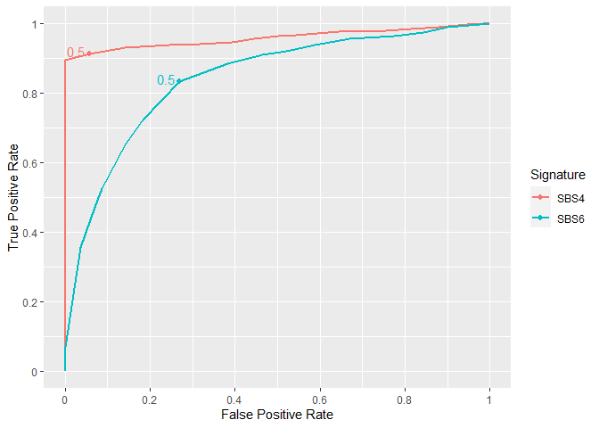
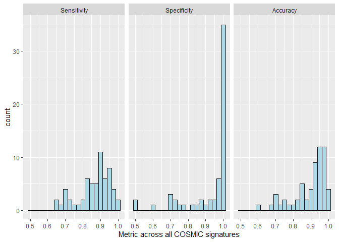
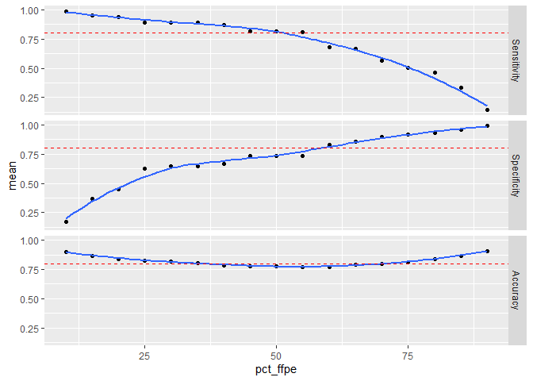

# Set up

We start our analysis by loading our libraries and functions from other files


```r
library(NMF)
library(MutationalPatterns)
library(tidyverse)
library(ggrepel)
library(ROCR)
library(kableExtra)
library(gridExtra)
library(broom)
library(plotROC)
source("bayes_function.R")
source("get_classification_df.R")
source("simulation.R")
```

We also define the function `vector_to_matrix` which allows to switch between representations of mutational profiles, in particular to use `plot_96_profile` from `MutationalPatterns`


```r
vector_to_matrix <- function(mutations.vector){
  tab <- table(mutations.vector)/sum(table(mutations.vector))
  #transform table to a data frame and assign column names to mutations and frequencies
  mutations.df <- data.frame(tab)
  colnames(mutations.df) <- c("mutations", "frequencies")
  
  #defines a function that joins two data frames and replaces NA with 0
  left_join_NA <- function(x, y, by) {
    left_join(x = x, y = y, by = by) %>% 
      mutate_each(funs(replace(., which(is.na(.)), 0)))
  }
  
  #converts vector of 96 mutation types to a data frame
  mutation.types.df <- data.frame(mutations)
  #joins together sample probabilities with data frame of mutation types so that all 96 mutation types are included
  complete.mutations.df <- left_join_NA(mutation.types.df, mutations.df, by = "mutations")
  
  #converts data frame of mutation types and frequencies to a data frame and assigns rownames
  mutations.matrix <- as.matrix(complete.mutations.df$frequencies)
  rownames(mutations.matrix) = mutations
  
  return(mutations.matrix)
}
```

We start by loading the FFPE mutational signatures and the SBS mutational signatures from COSMIC:


```r
#load FFPE signature as a matrix
ffpe_signature <- as.matrix(load_old_mutational_matrix("supplied_results/ffpe.signature.txt"))

#create vector of the 96 mutation types
mutations <- rownames(ffpe_signature) 

#Load COSMIC signatures (version 3)
cosmic_signatures <- get_known_signatures(muttype = "snv")

#Create vector of the signature names
signature_names <- colnames(cosmic_signatures)
```

And we create a list with all the COSMIC mutational signatures


```r
#Create list of signature matrices with assigned rownames
signature_matrix_list <- vector ("list", length(signature_names))
for (i in 1:length(signature_names)){
  sig <- cosmic_signatures[,i]
  sig_mat <- as.matrix(sig)
  rownames(sig_mat) <- mutations
  colnames(sig_mat) <- signature_names[i]
  signature_matrix_list[[i]] <- sig_mat
}
```


# Initial testing

We created two simulated datasets as follows:

* We combine 500 mutations from SBS4 and 500 mutations from FFPE

* We combine 500 mutations from SBS6 and 500 mutations from FFPE


## First dataset: SBS4

Let's create and visualize our first dataset by simulating mutations from SBS4


```r
set.seed(500)
signature_4_mat <- as.matrix(cosmic_signatures[,"SBS4"])
rownames(signature_4_mat) <- mutations

sig4_500 <- create_signature_sample_vector(signature_4_mat, 500)
sig4_profile <- vector_to_matrix(sig4_500)

plot_96_profile(sig4_profile)+
  labs(title = "Signature 4 Simulated Sample", x = "Context")+
  theme(plot.title = element_text(hjust = 0.5))
```

<!-- -->

Then, let's add the FFPE noise and visualize the resulting mutational profile


```r
addffpe_500 <- create_signature_sample_vector(ffpe_signature, 500)
sig4_ffpe <- vector_to_matrix(c(sig4_500, addffpe_500))

plot_96_profile(sig4_ffpe)+
  labs(title = "Simulated Sample with FFPE Noise", x = "Context")+
  theme(plot.title = element_text(hjust = 0.5))
```

<!-- -->

Now, let's apply our method on the simulated dataset:


```r
sig4_ffpe_tbl <- get_classification_df(
  list(sig4_500, addffpe_500),
  c("SBS4", "FFPE"), 
  list(signature_4_mat, ffpe_signature)) %>%
  as_tibble()
```

And calculate the confusion matrix


```r
(conf_mat <- table(sig4_ffpe_tbl$truth, sig4_ffpe_tbl$classify))
```

```
##       
##        FFPE SBS4
##   FFPE  500    0
##   SBS4   52  448
```

Our method is very good at identifying mutations that originated from the FFPE process, although some mutations originated from SBS4 gets missclassified as FFPE. Let's calculate the performance metrics:


```r
(sig4_sensitivity <- (conf_mat[2,2] / (conf_mat[2,2]+ conf_mat[2,1])))
```

```
## [1] 0.896
```

```r
(sig4_specificity <- (conf_mat[1,1] / (conf_mat[1,1]+ conf_mat[1,2])))
```

```
## [1] 1
```

## Second dataset: SBS6

Let's repeat the same experiment, this time using SBS6 as our baseline signature


```r
signature_6_mat <- as.matrix(cosmic_signatures[,"SBS6"])
rownames(signature_6_mat) <- mutations
sig6_500 <- create_signature_sample_vector(signature_6_mat, 500)

sig6_ffpe_tbl <- get_classification_df(
  list(sig6_500, addffpe_500),
  c("SBS6", "FFPE"),
  list(signature_6_mat, ffpe_signature))%>%
  as_tibble()
```

And let's calculate our confusion matrix and our performance characteristics


```r
(conf_mat <- table(sig6_ffpe_tbl$truth, sig6_ffpe_tbl$classify))
```

```
##       
##        FFPE SBS6
##   FFPE  365  135
##   SBS6   83  417
```

```r
(sig6_sensitivity <- (conf_mat[2,2] / (conf_mat[2,2]+ conf_mat[2,1])))
```

```
## [1] 0.834
```

```r
(sig6_specificity <- (conf_mat[1,1] / (conf_mat[1,1]+ conf_mat[1,2])))
```

```
## [1] 0.73
```

It seems this time our method did not perform as well. Let's create mutational profile plots for:

* The original profile (SBS6)
* The original profile (SBS6) plus the FFPE noise
* The profile obtained after filtering FFPE using `excerno`


```r
# Original profile
sig6_profile <- vector_to_matrix(sig6_500)
sig6_profile_plot <- plot_96_profile(sig6_profile)+
  labs(title = "Signature 6 Simulated Sample", x = "Context")+
  theme(plot.title = element_text(hjust = 0.5))
# Profile + FFPE noise
sig6_ffpe <- vector_to_matrix(c(sig6_500, addffpe_500))
sig6_ffpe_plot <- plot_96_profile(sig6_ffpe)+
  labs(title = "Simulated Sample with FFPE Noise", x = "Context")+
  theme(plot.title = element_text(hjust = 0.5))
# Profile after excerno
sig6_ffpe_filtered <- sig6_ffpe_tbl %>%
  filter(classify != "FFPE")
sig6_recon_matrix <- vector_to_matrix(sig6_ffpe_filtered$mutations)

sig6_recon_plot <- plot_96_profile(sig6_recon_matrix)+
  labs(title = "Signature 6 Reconstructed", x = "Context")+
  theme(plot.title = element_text(hjust = 0.5))

(sig6_grid <- grid.arrange(sig6_profile_plot, sig6_ffpe_plot, sig6_recon_plot))
```

<!-- -->

```
## TableGrob (3 x 1) "arrange": 3 grobs
##   z     cells    name           grob
## 1 1 (1-1,1-1) arrange gtable[layout]
## 2 2 (2-2,1-1) arrange gtable[layout]
## 3 3 (3-3,1-1) arrange gtable[layout]
```

```r
ggsave("paper_figures/sup1.png", sig6_grid, width = 175, height = 243, units = "mm")
```

It seems filtered SBS6 dataset differs from the original signature, particularly in C>T mutations preceded by an A or a T 


## ROC curve for both datasets

We would like to combine the information from both datasets (SBS4 and SBS6) in order to plot them together.


```r
sig4_tbl <- sig4_ffpe_tbl %>%
  select(truth, SBS4) %>%
  rename (bayes = SBS4) %>%
  mutate (dataset = "SBS4",
          truth = if_else (truth=="SBS4",1, 0))

sig6_tbl <- sig6_ffpe_tbl %>%
  select(truth, SBS6) %>%
  rename (bayes = SBS6) %>%
  mutate (dataset = "SBS6",
          truth = if_else (truth=="SBS6",1, 0))

allsim_tbl <- rbind (sig4_tbl, sig6_tbl)
```

And we generate the ROC curve for both datasets and calculate their AUC


```r
scale = seq (0, 1, by=0.2)

(roc_plot <- 
  ggplot(allsim_tbl, aes(d=truth, m=bayes, color=dataset))+
  geom_roc(cutoffs.at = c(0.5), cutoff.labels = c(0.5)) +
  labs(x="False Positive Rate",
       y="True Positive Rate",
       color="Signature")+
  scale_x_continuous(labels=scale, breaks=scale)+
  scale_y_continuous(labels=scale, breaks=scale))
```

<!-- -->

```r
ggsave("paper_figures/fig2a.png", roc_plot, width = 150, height = 90, units = "mm")

calc_auc(roc_plot)
```

```
##   PANEL group dataset      AUC
## 1     1     1    SBS4 0.959482
## 2     1     2    SBS6 0.842970
```

# The effect of mutational signatures in `excerno`

We hypothesize that the performance of our classifier depends on how the similarity of the base mutational signature against the FFPE signature.

## Initial Setup

A straightforward way of calculating the similarity across signatures is the cosine similarity. So we first generate the cosine similarity of all the COSMIC signatures against the FFPE signature:


```r
ffpe_cosmic_cos_sims <- vector(length=length(signature_names))
for (i in 1:length(signature_names)){
  cos_sim <- cos_sim_matrix(signature_matrix_list[[i]], ffpe_signature)
  ffpe_cosmic_cos_sims[i] <- cos_sim[1,1]
}
```

Second, we will create a function that mixes mutations from FFPE and another given mutational signature and calls `excerno`


```r
test_mix_mutations <- function (cosmic_idx, num_cosmic, num_ffpe) {

  # Create baseline mutations
  baseline_sig <- signature_matrix_list[[cosmic_idx]]
  baseline_name <- signature_names[cosmic_idx]
  baseline_mut_vec <- create_signature_sample_vector(baseline_sig, num_cosmic)
  
  # Create FFPE mutations
  ffpe_mut_vec <- create_signature_sample_vector(ffpe_signature, num_ffpe)

  # Call excerno classification and format as a tibble
  get_classification_df (list(baseline_mut_vec, ffpe_mut_vec), 
                          c(baseline_name,"FFPE"), 
                          list(baseline_sig, ffpe_signature)) %>% 
    as_tibble()
}
```

We try `test_mix_mutations` and plot the results to check it is working:


```r
set.seed(12345)
test_tbl <- test_mix_mutations(1,500,500)

test_tbl %>%
  select (mutations, truth, SBS1, FFPE) %>%
  pivot_longer(c(SBS1, FFPE)) %>%
  ggplot(aes(x=truth, y=value, fill=name)) +
    geom_boxplot() 
```

<!-- -->

Now let's create a function that calculates the performance metrics (sensitivity, specificity, accuracy) on the output of `test_mix_mutations`


```r
calc_metrics_mix <- function (cosmic_idx, num_cosmic, num_ffpe) {
  
  baseline_name <- signature_names[cosmic_idx]
  test_tbl <- test_mix_mutations(cosmic_idx,num_cosmic,num_ffpe)
  
  tp <- test_tbl %>%
    filter(truth == baseline_name & classify == baseline_name) %>%
    count() %>%
    pull(n)
  
  fp <- test_tbl %>%
    filter(truth != baseline_name & classify == baseline_name) %>%
    count() %>%
    pull(n)
    
  fn <- test_tbl %>%
    filter(truth == baseline_name & classify == "FFPE") %>%
    count() %>%
    pull(n)
  
  tn <- test_tbl %>%
    filter(truth == "FFPE" & classify == "FFPE") %>%
    count() %>%
    pull(n)
  
  tibble(
    Sensitivity = tp / (tp +fn),
    Specificity = tn / (tn + fp),
    Accuracy = (tp +tn) /(tp+tn+fp+fn))
}
```

And we test our method:


```r
set.seed(12345)

calc_metrics_mix(1,500,500)
```

```
## # A tibble: 1 x 3
##   Sensitivity Specificity Accuracy
##         <dbl>       <dbl>    <dbl>
## 1       0.956       0.922    0.939
```

```r
calc_metrics_mix(4,500,500)
```

```
## # A tibble: 1 x 3
##   Sensitivity Specificity Accuracy
##         <dbl>       <dbl>    <dbl>
## 1       0.906           1    0.953
```

```r
calc_metrics_mix(6,500,500)
```

```
## # A tibble: 1 x 3
##   Sensitivity Specificity Accuracy
##         <dbl>       <dbl>    <dbl>
## 1        0.81       0.736    0.773
```

Finally we create a function `calc_metrics_mix_num` that calculates the average metrics across a fixed number of simulations `num_iter` 


```r
calc_metrics_mix_num <- function (cosmic_idx, num_iter, num_cosmic, num_ffpe) {

  baseline_name <- signature_names[cosmic_idx]
  
  1:num_iter %>% 
    map_dfr(~calc_metrics_mix(cosmic_idx,num_cosmic,num_ffpe))  %>%
    pivot_longer(1:3) %>% 
    group_by(name) %>%
    summarize(mean = mean(value)) %>%
    mutate(sbs = baseline_name)
}
```

And we test it using our to-go signatures `SBS1`, `SBS4`, and `SBS6`


```r
calc_metrics_mix_num(1,10,500,500)
```

```
## # A tibble: 3 x 3
##   name         mean sbs  
##   <chr>       <dbl> <chr>
## 1 Accuracy    0.93  SBS1 
## 2 Sensitivity 0.948 SBS1 
## 3 Specificity 0.912 SBS1
```

```r
calc_metrics_mix_num(4,10,500,500)
```

```
## # A tibble: 3 x 3
##   name         mean sbs  
##   <chr>       <dbl> <chr>
## 1 Accuracy    0.955 SBS4 
## 2 Sensitivity 0.909 SBS4 
## 3 Specificity 1     SBS4
```

```r
calc_metrics_mix_num(6,10,500,500)
```

```
## # A tibble: 3 x 3
##   name         mean sbs  
##   <chr>       <dbl> <chr>
## 1 Accuracy    0.784 SBS6 
## 2 Sensitivity 0.826 SBS6 
## 3 Specificity 0.742 SBS6
```

## Testing across all COSMIC signatures

We are ready to generate the data over all of COSMIC mutational signatures, using 10 iterations and 500 mutations for FFPE and 500 mutations from the baseline COSMIC signature


```r
sbs_num = length(signature_names)
base_num = 500
ffpe_num = 500
reps = 10 

set.seed(123456)
sim_tbl <- 1:sbs_num %>%
  map_dfr(~calc_metrics_mix_num(.x, reps, base_num, ffpe_num))
```

We summarize the performance metrics across all the COSMIC mutational signatures


```r
sim_tbl <- sim_tbl %>%
  mutate (name = factor (name, 
                         levels = c("Sensitivity", "Specificity","Accuracy"))) 
sim_tbl %>%
  ggplot(aes(mean))+
  geom_histogram(binwidth = 0.025, color="black", fill="lightblue")+
  facet_grid(.~name) +
  labs(x="Metric across all COSMIC signatures")
```

<!-- -->

```r
summary_tbl <- sim_tbl %>%
  group_by(name) %>%
  summarize (median = median (mean),
           IQR = IQR(mean)) %>%
  mutate_if(is.numeric, format, digits=2)

summary_tbl %>%
  kbl() %>%
  kable_styling()
```

<table class="table" style="margin-left: auto; margin-right: auto;">
 <thead>
  <tr>
   <th style="text-align:left;"> name </th>
   <th style="text-align:left;"> median </th>
   <th style="text-align:left;"> IQR </th>
  </tr>
 </thead>
<tbody>
  <tr>
   <td style="text-align:left;"> Sensitivity </td>
   <td style="text-align:left;"> 0.89 </td>
   <td style="text-align:left;"> 0.111 </td>
  </tr>
  <tr>
   <td style="text-align:left;"> Specificity </td>
   <td style="text-align:left;"> 1.00 </td>
   <td style="text-align:left;"> 0.091 </td>
  </tr>
  <tr>
   <td style="text-align:left;"> Accuracy </td>
   <td style="text-align:left;"> 0.94 </td>
   <td style="text-align:left;"> 0.120 </td>
  </tr>
</tbody>
</table>

## Performance metrics vs similarity against FFPE signature

Now we explore the relationship of the performance metrics against the similarity between the baseline signature and FFPE :


```r
sim_tbl <- sim_tbl %>%
  mutate (ffpe_cos = rep(ffpe_cosmic_cos_sims, each=3))

sim_tbl %>%
  ggplot(aes(x=ffpe_cos, mean)) +
  geom_point()+
  geom_smooth(method="lm", formula = "y~x")+
  facet_grid(~name)
```

<!-- -->

To a varying extent it seems there is a linear trend across all the mutational signatures.

Now we define a function that polishes the previous graph and plots two signatures on it (`SBS4` and `SBS6`). The two fixed signatues will have different shape and color depending on whether or not they meet a threshold of 80%


```r
plot_metrics_excerno <- function (tbl, metrics, threshold) {

  fixed_sbs <- c("SBS4", "SBS6") # Fixed signatures
  
  # Subset the table to the specific metric  
  new_tbl <- filter(tbl, name %in% metrics) 
  # Identify signature that fall below the threshold
  fixed_below <- filter( new_tbl, (mean < threshold) & (sbs%in% fixed_sbs))
  fixed_above <- filter( new_tbl, (mean > threshold) & (sbs%in% fixed_sbs))
  

  ggplot(new_tbl, aes(x = ffpe_cos, y = mean))+
    geom_point()+
    geom_smooth(method = "lm", se=FALSE)+
    geom_point(data = fixed_below, fill = "red", shape=24, size=3)+
    geom_point(data = fixed_above, fill = "blue",shape=22, size=3)+
    geom_hline(yintercept=threshold, linetype="dashed", color = "red")+
    geom_label_repel(data=fixed_below, aes(label=sbs))+
    geom_label_repel(data=fixed_above, aes(label=sbs))+
    labs(x = "Cosine similarity against FFPE signature", 
         y="")+
    facet_wrap(.~name, strip.position="left")+
    theme(strip.text.y = element_text(size = 15),
          axis.title.x = element_text (size=15))
}
```

And we plot all the metrics using a threshold of 80%


```r
plot_metrics_excerno(sim_tbl, c("Sensitivity", "Specificity"),0.8)+
  scale_x_continuous(labels=scale, breaks=scale)
```

<!-- -->

```r
ggsave("paper_figures/fig2b.png", dpi = 300, width = 180, height = 90, units = "mm")
```

And we create a function for getting the coefficients of the linear model and their fit


```r
print_lm_coefs <- function (tbl, metric) {
  new_tbl <-  filter (tbl, name==metric)
  lm_metrics<- lm(mean ~ ffpe_cos, data = new_tbl)

  tidy(lm_metrics) %>%
    mutate_if(is.numeric, format, digits=2)%>%
    kbl() %>%
    kable_styling()
}

print_lm_fit <- function (tbl, metric) {
  new_tbl <-  filter (tbl, name==metric)
  lm_metrics<- lm(mean ~ ffpe_cos, data = new_tbl)

  glance(lm_metrics) %>%
    mutate_if(is.numeric, format, digits=2)%>%
    kbl() %>%
    kable_styling()
}
```

And print the information of the linear model for 

* Accuracy


```r
print_lm_coefs(sim_tbl, "Accuracy")
```

<table class="table" style="margin-left: auto; margin-right: auto;">
 <thead>
  <tr>
   <th style="text-align:left;"> term </th>
   <th style="text-align:left;"> estimate </th>
   <th style="text-align:left;"> std.error </th>
   <th style="text-align:left;"> statistic </th>
   <th style="text-align:left;"> p.value </th>
  </tr>
 </thead>
<tbody>
  <tr>
   <td style="text-align:left;"> (Intercept) </td>
   <td style="text-align:left;"> 0.99 </td>
   <td style="text-align:left;"> 0.0053 </td>
   <td style="text-align:left;"> 186 </td>
   <td style="text-align:left;"> 3.3e-82 </td>
  </tr>
  <tr>
   <td style="text-align:left;"> ffpe_cos </td>
   <td style="text-align:left;"> -0.37 </td>
   <td style="text-align:left;"> 0.0149 </td>
   <td style="text-align:left;"> -24 </td>
   <td style="text-align:left;"> 2.9e-32 </td>
  </tr>
</tbody>
</table>

```r
print_lm_fit(sim_tbl, "Accuracy")
```

<table class="table" style="margin-left: auto; margin-right: auto;">
 <thead>
  <tr>
   <th style="text-align:left;"> r.squared </th>
   <th style="text-align:left;"> adj.r.squared </th>
   <th style="text-align:left;"> sigma </th>
   <th style="text-align:left;"> statistic </th>
   <th style="text-align:left;"> p.value </th>
   <th style="text-align:left;"> df </th>
   <th style="text-align:left;"> logLik </th>
   <th style="text-align:left;"> AIC </th>
   <th style="text-align:left;"> BIC </th>
   <th style="text-align:left;"> deviance </th>
   <th style="text-align:left;"> df.residual </th>
   <th style="text-align:left;"> nobs </th>
  </tr>
 </thead>
<tbody>
  <tr>
   <td style="text-align:left;"> 0.91 </td>
   <td style="text-align:left;"> 0.91 </td>
   <td style="text-align:left;"> 0.028 </td>
   <td style="text-align:left;"> 600 </td>
   <td style="text-align:left;"> 2.9e-32 </td>
   <td style="text-align:left;"> 1 </td>
   <td style="text-align:left;"> 129 </td>
   <td style="text-align:left;"> -253 </td>
   <td style="text-align:left;"> -247 </td>
   <td style="text-align:left;"> 0.047 </td>
   <td style="text-align:left;"> 58 </td>
   <td style="text-align:left;"> 60 </td>
  </tr>
</tbody>
</table>

* Sensitivity


```r
print_lm_coefs(sim_tbl, "Sensitivity")
```

<table class="table" style="margin-left: auto; margin-right: auto;">
 <thead>
  <tr>
   <th style="text-align:left;"> term </th>
   <th style="text-align:left;"> estimate </th>
   <th style="text-align:left;"> std.error </th>
   <th style="text-align:left;"> statistic </th>
   <th style="text-align:left;"> p.value </th>
  </tr>
 </thead>
<tbody>
  <tr>
   <td style="text-align:left;"> (Intercept) </td>
   <td style="text-align:left;"> 0.94 </td>
   <td style="text-align:left;"> 0.010 </td>
   <td style="text-align:left;"> 92 </td>
   <td style="text-align:left;"> 1.2e-64 </td>
  </tr>
  <tr>
   <td style="text-align:left;"> ffpe_cos </td>
   <td style="text-align:left;"> -0.31 </td>
   <td style="text-align:left;"> 0.029 </td>
   <td style="text-align:left;"> -11 </td>
   <td style="text-align:left;"> 2.5e-15 </td>
  </tr>
</tbody>
</table>

```r
print_lm_fit(sim_tbl, "Sensitivity")
```

<table class="table" style="margin-left: auto; margin-right: auto;">
 <thead>
  <tr>
   <th style="text-align:left;"> r.squared </th>
   <th style="text-align:left;"> adj.r.squared </th>
   <th style="text-align:left;"> sigma </th>
   <th style="text-align:left;"> statistic </th>
   <th style="text-align:left;"> p.value </th>
   <th style="text-align:left;"> df </th>
   <th style="text-align:left;"> logLik </th>
   <th style="text-align:left;"> AIC </th>
   <th style="text-align:left;"> BIC </th>
   <th style="text-align:left;"> deviance </th>
   <th style="text-align:left;"> df.residual </th>
   <th style="text-align:left;"> nobs </th>
  </tr>
 </thead>
<tbody>
  <tr>
   <td style="text-align:left;"> 0.66 </td>
   <td style="text-align:left;"> 0.66 </td>
   <td style="text-align:left;"> 0.055 </td>
   <td style="text-align:left;"> 114 </td>
   <td style="text-align:left;"> 2.5e-15 </td>
   <td style="text-align:left;"> 1 </td>
   <td style="text-align:left;"> 90 </td>
   <td style="text-align:left;"> -175 </td>
   <td style="text-align:left;"> -168 </td>
   <td style="text-align:left;"> 0.17 </td>
   <td style="text-align:left;"> 58 </td>
   <td style="text-align:left;"> 60 </td>
  </tr>
</tbody>
</table>

* Specificity

```r
print_lm_coefs(sim_tbl, "Specificity")
```

<table class="table" style="margin-left: auto; margin-right: auto;">
 <thead>
  <tr>
   <th style="text-align:left;"> term </th>
   <th style="text-align:left;"> estimate </th>
   <th style="text-align:left;"> std.error </th>
   <th style="text-align:left;"> statistic </th>
   <th style="text-align:left;"> p.value </th>
  </tr>
 </thead>
<tbody>
  <tr>
   <td style="text-align:left;"> (Intercept) </td>
   <td style="text-align:left;"> 1.04 </td>
   <td style="text-align:left;"> 0.014 </td>
   <td style="text-align:left;"> 75 </td>
   <td style="text-align:left;"> 2.1e-59 </td>
  </tr>
  <tr>
   <td style="text-align:left;"> ffpe_cos </td>
   <td style="text-align:left;"> -0.42 </td>
   <td style="text-align:left;"> 0.039 </td>
   <td style="text-align:left;"> -11 </td>
   <td style="text-align:left;"> 9.4e-16 </td>
  </tr>
</tbody>
</table>

```r
print_lm_fit(sim_tbl, "Specificity")
```

<table class="table" style="margin-left: auto; margin-right: auto;">
 <thead>
  <tr>
   <th style="text-align:left;"> r.squared </th>
   <th style="text-align:left;"> adj.r.squared </th>
   <th style="text-align:left;"> sigma </th>
   <th style="text-align:left;"> statistic </th>
   <th style="text-align:left;"> p.value </th>
   <th style="text-align:left;"> df </th>
   <th style="text-align:left;"> logLik </th>
   <th style="text-align:left;"> AIC </th>
   <th style="text-align:left;"> BIC </th>
   <th style="text-align:left;"> deviance </th>
   <th style="text-align:left;"> df.residual </th>
   <th style="text-align:left;"> nobs </th>
  </tr>
 </thead>
<tbody>
  <tr>
   <td style="text-align:left;"> 0.67 </td>
   <td style="text-align:left;"> 0.67 </td>
   <td style="text-align:left;"> 0.074 </td>
   <td style="text-align:left;"> 120 </td>
   <td style="text-align:left;"> 9.4e-16 </td>
   <td style="text-align:left;"> 1 </td>
   <td style="text-align:left;"> 72 </td>
   <td style="text-align:left;"> -138 </td>
   <td style="text-align:left;"> -132 </td>
   <td style="text-align:left;"> 0.32 </td>
   <td style="text-align:left;"> 58 </td>
   <td style="text-align:left;"> 60 </td>
  </tr>
</tbody>
</table>

# The effect of FFPE percent in the performance of `excerno`.

We are interested in the performance characteristics of excerno under different percentages of FFPE signature. 

## An initial simulation

So we will mimic our original scenario scenario of `SBS4` and `SBS6`, however this time we will introduce varying proportions going from 10% to 90% every 5%.

Let's start with SBS4:


```r
set.seed(654321)
pct_ffpe = seq (10,90, by=5)
metrics_order = c("Sensitivity","Specificity", "Accuracy")

sbs4_dilution_tbl <- pct_ffpe %>%
  map_dfr(~calc_metrics_mix_num(4,10, (100-.x)*10, .x*10)) %>%
  mutate(pct_ffpe = rep(pct_ffpe, each=3),
         name = factor (name, levels = metrics_order))
```

And plot it


```r
ggplot(sbs4_dilution_tbl, 
       aes(x=pct_ffpe, y=mean)) +
  geom_point()+
  geom_smooth(se=FALSE)+
  facet_grid(name~.) + 
  geom_hline(yintercept=0.8, linetype="dashed",color = "red")
```

<!-- -->

Seems the metrics stay above 80%, except for specificity at 10% which slightly dips below 80%

Let's do the same analysis with SBS6:


```r
sbs6_dilution_tbl <- pct_ffpe %>%
  map_dfr(~calc_metrics_mix_num(6,10, (100-.x)*10, .x*10)) %>%
  mutate(pct_ffpe = rep(pct_ffpe, each=3),
         name = factor (name, levels = metrics_order))

ggplot(sbs6_dilution_tbl, 
       aes(x=pct_ffpe, y=mean)) +
  geom_point()+
  geom_smooth(se=FALSE, method="loess", formula=y~x)+
  facet_grid(name~.) + 
  geom_hline(yintercept=0.8, linetype="dashed",color = "red")
```

<!-- -->

Here we see how sensitivity dips below our threshold for all ffpe percentages *above* 60% ffpe and specificity drops below 80% for all the % ffpe *below* 50%. Accuracy stays mostly above 80% and it is best when there is only one class of mutations (either FFPE or a single SBS)

Let's combine both datasets in a single graph, focusing on sensitivity and specificity and coloring by signature


```r
dilution_tbl <- rbind (sbs4_dilution_tbl, sbs6_dilution_tbl)

scale_x = seq (10,90, by=10)
scale_y = seq (0.2, 1, by=0.2)

dilution_tbl %>%
  filter(name != "Accuracy") %>%
  ggplot(aes(x=pct_ffpe, y=mean, color=sbs, shape=sbs)) +
    geom_point()+
    geom_smooth(se=FALSE,formula=y~x, method=loess)+
    facet_wrap(.~name, strip.position="left")+
    geom_hline(yintercept=0.8, linetype="dashed",color = "red")+
    labs(x= "Percent of FFPE signature",
         y="",
         color = "Signature",
         shape="")+
    scale_x_continuous(breaks = scale_x, labels = scale_x)+
    scale_y_continuous(breaks = scale_y, labels = scale_y)+
    theme(strip.text.y = element_text(size = 15),
          axis.title.x = element_text (size=15))+
    guides(shape= "none")
```

<!-- -->

```r
ggsave("paper_figures/fig3a.png", dpi = 300, width = 180, height = 90, units = "mm")
```

Notice the trend is that for increasing percent of FFPE signature, the sensitivity decreases, while the specificity increases.

## Simulating across all COSMIC signatures

We are interested in assessing the trends in performance metrics across *all* of the signatures in COSMIC. In order to do that we need to create an auxiliary function `calc_dillution_metrics` that generates a tibble with this information for a particular mutational signature. We also create a function `plot_dillution_metrics` that plots this information


```r
calc_dillution_metrics <- function (ffpe_grid, cosmic_idx) {
  metrics_order = c("Sensitivity","Specificity", "Accuracy")
  sig_name=factor(signature_names[cosmic_idx], signature_names)

  ffpe_grid %>%
    map_dfr(~calc_metrics_mix_num(cosmic_idx,10, (100-.x)*10, .x*10)) %>%
    mutate(pct_ffpe = rep(ffpe_grid, each=3),
         sbs = sig_name,
         metric = factor (name, levels = metrics_order)) %>%
    select(-c(name))
}

plot_dillution_metrics <- function (sim_tbl) {
  scale_x = seq (10,90, by=10)
  scale_y = seq (0.2, 1, by=0.2)

  sim_tbl %>%
  ggplot(aes(x=pct_ffpe, y=mean, color=sbs)) +
    geom_point()+
    geom_smooth(se=FALSE)+
    facet_grid(metric~.) + 
    geom_hline(yintercept=0.8, linetype="dashed",color = "red")+
    labs(x= "Percent of FFPE signature",
         y="",
         color = "Signature")+
    scale_x_continuous(breaks = scale_x, labels = scale_x)+
    scale_y_continuous(breaks = scale_y, labels = scale_y)
}
```

We test our functions for SBS4 and SBS6:


```r
calc_dillution_metrics(pct_ffpe, 4) %>%
  plot_dillution_metrics()
```

<!-- -->

```r
calc_dillution_metrics(pct_ffpe, 6) %>%
  plot_dillution_metrics()
```

<!-- -->

Now we are ready to calculate the dilution metrics across all COSMIC mutational signatures (this takes 20min to run)


```r
set.seed(123456)
# sbs_num <- 3
# Full dataset run
sim_dillution_tbl <- 1:sbs_num %>%
  map_dfr(~calc_dillution_metrics(pct_ffpe, .x))

rep_ffpe_cos <- rep(ffpe_cosmic_cos_sims[1:sbs_num], each=length(pct_ffpe)*3)

sim_dillution_tbl <-  sim_dillution_tbl %>%
  mutate (ffpe_cos = rep_ffpe_cos)
```

And we plot the sensitivity and specificity across all levels of FFPE contamination as a scatter plot:


```r
scale_x = seq (10,90, by=10)
scale_y = seq (0.2, 1, by=0.2)

sim_dillution_tbl %>%
  filter (metric!="Accuracy") %>%
  ggplot (aes(x=pct_ffpe, y=mean)) +
    geom_smooth(se=FALSE, method="loess", formula="y~x", size=.75)+
    geom_point (alpha=0.2) +
    facet_wrap(.~metric, strip.position="left")+
    geom_hline(yintercept=0.8, linetype="dashed",color = "red", size=0.5)+
    scale_x_continuous(breaks = scale_x, labels = scale_x)+
    scale_y_continuous(breaks = scale_y, labels = scale_y)+
    labs(x= "Percent of FFPE signature",
         y="")+
    theme(strip.text.y = element_text(size = 15),
          axis.title.x = element_text (size = 15))
```

<!-- -->

```r
ggsave("paper_figures/supp2.png", dpi = 300, width = 180, height = 90, units = "mm")
```

We are interested in plotting the performance characteristics across multiple dilution levels so we define a function to do that:


```r
plot_metrics_grid_excerno <- function (tbl, grid, fixed_sbs, metrics, threshold) {

  # Subset the table to the specific metric  
  new_tbl <- filter(tbl, metric %in% metrics & pct_ffpe %in% grid) 
  fixed_below <- filter( new_tbl, (mean < threshold) & (sbs%in% fixed_sbs))
  fixed_above <- filter( new_tbl, (mean > threshold) & (sbs%in% fixed_sbs))
  

  grid.labs <- str_c(grid,"% FFPE")
  names(grid.labs) <- grid
  
  ggplot(new_tbl, aes(x = ffpe_cos, y = mean))+
    geom_point()+
    geom_smooth(method = "lm", se=FALSE, formula="y~x")+
    geom_hline(yintercept=threshold, linetype="dashed", color = "red")+
    geom_point(data = fixed_below, fill = "red", shape=24, size=3)+
    geom_point(data = fixed_above, fill = "blue",shape=22, size=3)+
    geom_label_repel(data=fixed_below, aes(label=sbs))+
    geom_label_repel(data=fixed_above, aes(label=sbs))+
    facet_grid(pct_ffpe~metric, labeller=labeller(pct_ffpe=grid.labs))+
    labs(x = "Cosine similarity against FFPE signature", 
         y = "")+
    theme(strip.text.x = element_text(size = 15),
          strip.text.y = element_text(size = 12),
          axis.title.x = element_text (size=15))
}
```


```r
perf_grid = c(10,30,50,70,90)
fixed_sbs = c("SBS4", "SBS6")
plot_metrics_grid_excerno(sim_dillution_tbl, perf_grid, 
                          fixed_sbs, c("Sensitivity","Specificity"),0.8)
```

<!-- -->

```r
ggsave("paper_figures/fig3b.png", dpi = 300, width = 150, height = 150, units = "mm")
```

From these graphs we observe that

* In the sensitivity plot, the slope of the trend line decreases as the percent FFPE increases.
* In the specificity plot, the slope of the trend line increases as the percent FFPE increases.

In order to quantify and make these observations more precise we will build linear models with an interaction term between the cosine similarity against the FFPE signature and the percent FFPE. In order to do that we need the following functions:


```r
print_lm_coefs <- function (tbl, metric_name, formula) {
  new_tbl <-  filter (tbl, metric==metric_name)
  lm_metrics<- lm(formula, data = new_tbl)

  tidy(lm_metrics) %>%
    mutate_if(is.numeric, format, digits=1)%>%
    kbl() %>%
    kable_styling()
}

print_lm_fit <- function (tbl, metric_name, formula) {
  new_tbl <-  filter (tbl, metric==metric_name)
  lm_metrics<- lm(formula, data = new_tbl)

  glance(lm_metrics) %>%
    mutate_if(is.numeric, format, digits=2)%>%
    kbl() %>%
    kable_styling()
}
```

Finally we make sure that the ffpe content is on the decimal scale (to be consistent) with the cosine similarity, which is a number from 0 to 1.


```r
sim_dillution_tbl <- sim_dillution_tbl %>%
  mutate(ffpe = pct_ffpe/100)
```

Here is the information of the models for sensitivity and specificity

* Sensitivity:


```r
print_lm_coefs(sim_dillution_tbl, "Sensitivity", "mean~ffpe*ffpe_cos")
```

<table class="table" style="margin-left: auto; margin-right: auto;">
 <thead>
  <tr>
   <th style="text-align:left;"> term </th>
   <th style="text-align:left;"> estimate </th>
   <th style="text-align:left;"> std.error </th>
   <th style="text-align:left;"> statistic </th>
   <th style="text-align:left;"> p.value </th>
  </tr>
 </thead>
<tbody>
  <tr>
   <td style="text-align:left;"> (Intercept) </td>
   <td style="text-align:left;"> 0.92 </td>
   <td style="text-align:left;"> 0.007 </td>
   <td style="text-align:left;"> 123 </td>
   <td style="text-align:left;"> 0e+00 </td>
  </tr>
  <tr>
   <td style="text-align:left;"> ffpe </td>
   <td style="text-align:left;"> 0.09 </td>
   <td style="text-align:left;"> 0.013 </td>
   <td style="text-align:left;"> 7 </td>
   <td style="text-align:left;"> 1e-11 </td>
  </tr>
  <tr>
   <td style="text-align:left;"> ffpe_cos </td>
   <td style="text-align:left;"> 0.36 </td>
   <td style="text-align:left;"> 0.021 </td>
   <td style="text-align:left;"> 17 </td>
   <td style="text-align:left;"> 2e-58 </td>
  </tr>
  <tr>
   <td style="text-align:left;"> ffpe:ffpe_cos </td>
   <td style="text-align:left;"> -1.59 </td>
   <td style="text-align:left;"> 0.038 </td>
   <td style="text-align:left;"> -42 </td>
   <td style="text-align:left;"> 1e-226 </td>
  </tr>
</tbody>
</table>

```r
print_lm_fit(sim_dillution_tbl, "Sensitivity", "mean~ffpe*ffpe_cos")
```

<table class="table" style="margin-left: auto; margin-right: auto;">
 <thead>
  <tr>
   <th style="text-align:left;"> r.squared </th>
   <th style="text-align:left;"> adj.r.squared </th>
   <th style="text-align:left;"> sigma </th>
   <th style="text-align:left;"> statistic </th>
   <th style="text-align:left;"> p.value </th>
   <th style="text-align:left;"> df </th>
   <th style="text-align:left;"> logLik </th>
   <th style="text-align:left;"> AIC </th>
   <th style="text-align:left;"> BIC </th>
   <th style="text-align:left;"> deviance </th>
   <th style="text-align:left;"> df.residual </th>
   <th style="text-align:left;"> nobs </th>
  </tr>
 </thead>
<tbody>
  <tr>
   <td style="text-align:left;"> 0.84 </td>
   <td style="text-align:left;"> 0.84 </td>
   <td style="text-align:left;"> 0.072 </td>
   <td style="text-align:left;"> 1742 </td>
   <td style="text-align:left;"> 0 </td>
   <td style="text-align:left;"> 3 </td>
   <td style="text-align:left;"> 1232 </td>
   <td style="text-align:left;"> -2454 </td>
   <td style="text-align:left;"> -2429 </td>
   <td style="text-align:left;"> 5.3 </td>
   <td style="text-align:left;"> 1016 </td>
   <td style="text-align:left;"> 1020 </td>
  </tr>
</tbody>
</table>

* Specificity


```r
print_lm_coefs(sim_dillution_tbl, "Specificity", "mean~ffpe*ffpe_cos")
```

<table class="table" style="margin-left: auto; margin-right: auto;">
 <thead>
  <tr>
   <th style="text-align:left;"> term </th>
   <th style="text-align:left;"> estimate </th>
   <th style="text-align:left;"> std.error </th>
   <th style="text-align:left;"> statistic </th>
   <th style="text-align:left;"> p.value </th>
  </tr>
 </thead>
<tbody>
  <tr>
   <td style="text-align:left;"> (Intercept) </td>
   <td style="text-align:left;"> 1.00 </td>
   <td style="text-align:left;"> 0.01 </td>
   <td style="text-align:left;"> 103 </td>
   <td style="text-align:left;"> 0e+00 </td>
  </tr>
  <tr>
   <td style="text-align:left;"> ffpe </td>
   <td style="text-align:left;"> 0.02 </td>
   <td style="text-align:left;"> 0.02 </td>
   <td style="text-align:left;"> 1 </td>
   <td style="text-align:left;"> 3e-01 </td>
  </tr>
  <tr>
   <td style="text-align:left;"> ffpe_cos </td>
   <td style="text-align:left;"> -1.25 </td>
   <td style="text-align:left;"> 0.03 </td>
   <td style="text-align:left;"> -46 </td>
   <td style="text-align:left;"> 1e-250 </td>
  </tr>
  <tr>
   <td style="text-align:left;"> ffpe:ffpe_cos </td>
   <td style="text-align:left;"> 1.56 </td>
   <td style="text-align:left;"> 0.05 </td>
   <td style="text-align:left;"> 32 </td>
   <td style="text-align:left;"> 6e-156 </td>
  </tr>
</tbody>
</table>

```r
print_lm_fit(sim_dillution_tbl, "Specificity", "mean~ffpe*ffpe_cos")
```

<table class="table" style="margin-left: auto; margin-right: auto;">
 <thead>
  <tr>
   <th style="text-align:left;"> r.squared </th>
   <th style="text-align:left;"> adj.r.squared </th>
   <th style="text-align:left;"> sigma </th>
   <th style="text-align:left;"> statistic </th>
   <th style="text-align:left;"> p.value </th>
   <th style="text-align:left;"> df </th>
   <th style="text-align:left;"> logLik </th>
   <th style="text-align:left;"> AIC </th>
   <th style="text-align:left;"> BIC </th>
   <th style="text-align:left;"> deviance </th>
   <th style="text-align:left;"> df.residual </th>
   <th style="text-align:left;"> nobs </th>
  </tr>
 </thead>
<tbody>
  <tr>
   <td style="text-align:left;"> 0.79 </td>
   <td style="text-align:left;"> 0.79 </td>
   <td style="text-align:left;"> 0.094 </td>
   <td style="text-align:left;"> 1268 </td>
   <td style="text-align:left;"> 0 </td>
   <td style="text-align:left;"> 3 </td>
   <td style="text-align:left;"> 969 </td>
   <td style="text-align:left;"> -1928 </td>
   <td style="text-align:left;"> -1903 </td>
   <td style="text-align:left;"> 8.9 </td>
   <td style="text-align:left;"> 1016 </td>
   <td style="text-align:left;"> 1020 </td>
  </tr>
</tbody>
</table>

# Using real data

We are going use 6 files from this study ...

## Preprocessing

Let's start by listing the 6 VCF files from the `supplied_results` folder:


```r
library(vcfR)
library(R.utils)
library(tidyverse)
vcf_files <- list.files(path="supplied_results",pattern = "vcf", full.names = TRUE)
```

We will be subsetting each of those files to the variants for which we have confident information in the DNA. We can assure that by requiring `GQ >30` (Genotype Quality) on the exome side


```r
for (i in 1:length(vcf_files)) {
  name <- vcf_files[i]
  vcf <- read.vcfR(name)
  filter_name <- str_replace_all(name,"vcf","dna.vcf.gz")
  out_vcf_name <- str_replace_all(name,"vcf", "dna.vcf")

  gq <-  extract.gt(vcf, element="GQ", as.numeric=TRUE)
  write.vcf(vcf[which(gq[,1]>30),], file=filter_name)
  gunzip(filter_name, out_vcf_name)
}
```


## Running excerno

We ran excerno on the 6 vcf files and use the NMF option


```r
library(MutationalPatterns)
library(BSgenome)
library(excerno)
ref_genome <- "BSgenome.Hsapiens.UCSC.hg38"
library(ref_genome, character.only = TRUE)

vcf_files <- list.files(path="supplied_results",pattern = "dna.vcf", full.names = TRUE)
excerno_vcf(vcf_files,method="nmf",2)
```

```
## [1] "INFO [14:21:05] Creating mutational vectors"
## [1] "INFO [14:21:18] Performing NMF"
## [1] "INFO [14:21:36] Generating classification data frames"
## [1] "INFO [14:21:37] Loading in values to vcf files"
```

## Calculating performance metrics

We first create a function that allows to collect information on a filtered vcf file


```r
get_metrics <- function (file, sample_name) {
  vcf <- read.vcfR(file)
  gt <- extract.gt(vcf)

  # Calculate the errors in the true variants  
  true_variants <- vcf[which(gt[,1]!="0/0"),]
  all_true <- as.numeric(dim(true_variants)[1])
  true_classify <- getFIX(true_variants)[,7]
  fn <- sum(is.na(true_classify))
  tp <- all_true -fn
  
  # Calculate the errors in the false variants
  false_variants <- vcf[which(gt[,1]=="0/0"),]
  all_false <- as.numeric(dim(false_variants)[1])
  false_classify <- getFIX(false_variants)[,7]
  tn <- sum(is.na(false_classify))
  fp <- all_false - tn
  sum(is.na(true_classify))

  # Calculate sensitivity and speficifty
  (sens <-  tp /all_true)
  (spec <- tn /all_false)
  (ffpe_pct <- all_false/(all_false+all_true))
  (total <- all_false+all_true)
  accuracy <- (tp + tn)/(all_true+all_false)
  
  tibble(Name=sample_name, `% FFPE`= round(ffpe_pct*100), `# Mutations`=total,
         Accuracy=accuracy, Specificity=spec, Sensitivity=sens)
}
```

Now we list the classified files from `excerno` 


```r
vcf_files <- list.files(pattern = "vcf", full.names = TRUE)
sample_names = c("MLH1G_10", "MSH6_1","MSH6_2", "MSH6_8", "PMS2_10", "PMS2_9")
```

And we generate the table with information from the samples


```r
(perf_tbl <- 1:6 %>%
  map_dfr(~get_metrics(vcf_files[.x], sample_names[.x])) %>%
  arrange(desc(`% FFPE`)) %>%
  mutate(`% FFPE`=str_c(`% FFPE`,"%")) %>%
  mutate(across(c("Accuracy","Sensitivity", "Specificity"),
                ~format(.x,digits=2, justify="right")))%>%
  mutate(across(c(`# Mutations`), ~format(.x,big.mark=",", justify="right"))) %>%
  kbl(caption = "Table 1. Assessment of excerno on real samples", 
      align=c("l", rep("r",5))) %>%
  kable_classic(full_width = F, html_font = "Cambria"))
```

```
## Scanning file to determine attributes.
## File attributes:
##   meta lines: 34
##   header_line: 35
##   variant count: 470
##   column count: 11
## 
Meta line 34 read in.
## All meta lines processed.
## gt matrix initialized.
## Character matrix gt created.
##   Character matrix gt rows: 470
##   Character matrix gt cols: 11
##   skip: 0
##   nrows: 470
##   row_num: 0
## 
Processed variant: 470
## All variants processed
## Scanning file to determine attributes.
## File attributes:
##   meta lines: 34
##   header_line: 35
##   variant count: 358
##   column count: 11
## 
Meta line 34 read in.
## All meta lines processed.
## gt matrix initialized.
## Character matrix gt created.
##   Character matrix gt rows: 358
##   Character matrix gt cols: 11
##   skip: 0
##   nrows: 358
##   row_num: 0
## 
Processed variant: 358
## All variants processed
## Scanning file to determine attributes.
## File attributes:
##   meta lines: 34
##   header_line: 35
##   variant count: 282
##   column count: 11
## 
Meta line 34 read in.
## All meta lines processed.
## gt matrix initialized.
## Character matrix gt created.
##   Character matrix gt rows: 282
##   Character matrix gt cols: 11
##   skip: 0
##   nrows: 282
##   row_num: 0
## 
Processed variant: 282
## All variants processed
## Scanning file to determine attributes.
## File attributes:
##   meta lines: 34
##   header_line: 35
##   variant count: 3370
##   column count: 11
## 
Meta line 34 read in.
## All meta lines processed.
## gt matrix initialized.
## Character matrix gt created.
##   Character matrix gt rows: 3370
##   Character matrix gt cols: 11
##   skip: 0
##   nrows: 3370
##   row_num: 0
## 
Processed variant 1000
Processed variant 2000
Processed variant 3000
Processed variant: 3370
## All variants processed
## Scanning file to determine attributes.
## File attributes:
##   meta lines: 34
##   header_line: 35
##   variant count: 1222
##   column count: 11
## 
Meta line 34 read in.
## All meta lines processed.
## gt matrix initialized.
## Character matrix gt created.
##   Character matrix gt rows: 1222
##   Character matrix gt cols: 11
##   skip: 0
##   nrows: 1222
##   row_num: 0
## 
Processed variant 1000
Processed variant: 1222
## All variants processed
## Scanning file to determine attributes.
## File attributes:
##   meta lines: 34
##   header_line: 35
##   variant count: 1751
##   column count: 11
## 
Meta line 34 read in.
## All meta lines processed.
## gt matrix initialized.
## Character matrix gt created.
##   Character matrix gt rows: 1751
##   Character matrix gt cols: 11
##   skip: 0
##   nrows: 1751
##   row_num: 0
## 
Processed variant 1000
Processed variant: 1751
## All variants processed
```

<table class=" lightable-classic" style="font-family: Cambria; width: auto !important; margin-left: auto; margin-right: auto;">
<caption>Table 1. Assessment of excerno on real samples</caption>
 <thead>
  <tr>
   <th style="text-align:left;"> Name </th>
   <th style="text-align:right;"> % FFPE </th>
   <th style="text-align:right;"> # Mutations </th>
   <th style="text-align:right;"> Accuracy </th>
   <th style="text-align:right;"> Specificity </th>
   <th style="text-align:right;"> Sensitivity </th>
  </tr>
 </thead>
<tbody>
  <tr>
   <td style="text-align:left;"> MSH6_8 </td>
   <td style="text-align:right;"> 96% </td>
   <td style="text-align:right;"> 3,370 </td>
   <td style="text-align:right;"> 0.96 </td>
   <td style="text-align:right;"> 1.00 </td>
   <td style="text-align:right;"> 0.00 </td>
  </tr>
  <tr>
   <td style="text-align:left;"> PMS2_10 </td>
   <td style="text-align:right;"> 73% </td>
   <td style="text-align:right;"> 1,222 </td>
   <td style="text-align:right;"> 0.75 </td>
   <td style="text-align:right;"> 0.85 </td>
   <td style="text-align:right;"> 0.47 </td>
  </tr>
  <tr>
   <td style="text-align:left;"> PMS2_9 </td>
   <td style="text-align:right;"> 32% </td>
   <td style="text-align:right;"> 1,751 </td>
   <td style="text-align:right;"> 0.65 </td>
   <td style="text-align:right;"> 0.38 </td>
   <td style="text-align:right;"> 0.78 </td>
  </tr>
  <tr>
   <td style="text-align:left;"> MLH1G_10 </td>
   <td style="text-align:right;"> 26% </td>
   <td style="text-align:right;"> 470 </td>
   <td style="text-align:right;"> 0.74 </td>
   <td style="text-align:right;"> 0.17 </td>
   <td style="text-align:right;"> 0.94 </td>
  </tr>
  <tr>
   <td style="text-align:left;"> MSH6_2 </td>
   <td style="text-align:right;"> 8% </td>
   <td style="text-align:right;"> 282 </td>
   <td style="text-align:right;"> 0.91 </td>
   <td style="text-align:right;"> 0.00 </td>
   <td style="text-align:right;"> 0.99 </td>
  </tr>
  <tr>
   <td style="text-align:left;"> MSH6_1 </td>
   <td style="text-align:right;"> 7% </td>
   <td style="text-align:right;"> 358 </td>
   <td style="text-align:right;"> 0.92 </td>
   <td style="text-align:right;"> 0.12 </td>
   <td style="text-align:right;"> 0.98 </td>
  </tr>
</tbody>
</table>

```r
#save_kable(perf_tbl,"paper_figures/table_1.pdf")
```


# Conclusion

We tested our method across varying levels of FFPE content and across different mutational signatures. We found that the performance characteristics of our method decrease as the cosine similarity against the FFPE signature increases. We also establish that FFPE content increases, our sensitivity decreases and our specificity increases and establish linear models with good fit.

This analysis was done using the following environment:


```r
sessionInfo()
```

```
## R version 4.1.0 (2021-05-18)
## Platform: x86_64-w64-mingw32/x64 (64-bit)
## Running under: Windows 10 x64 (build 19043)
## 
## Matrix products: default
## 
## locale:
## [1] LC_COLLATE=English_United States.1252 
## [2] LC_CTYPE=English_United States.1252   
## [3] LC_MONETARY=English_United States.1252
## [4] LC_NUMERIC=C                          
## [5] LC_TIME=English_United States.1252    
## 
## attached base packages:
## [1] stats4    parallel  stats     graphics  grDevices utils     datasets 
## [8] methods   base     
## 
## other attached packages:
##  [1] doParallel_1.0.17                 iterators_1.0.14                 
##  [3] foreach_1.5.2                     BSgenome.Hsapiens.UCSC.hg38_1.4.3
##  [5] excerno_0.1.0                     BSgenome_1.60.0                  
##  [7] rtracklayer_1.52.1                Biostrings_2.60.2                
##  [9] XVector_0.32.0                    R.utils_2.12.0                   
## [11] R.oo_1.25.0                       R.methodsS3_1.8.2                
## [13] vcfR_1.13.0                       plotROC_2.3.0                    
## [15] broom_1.0.0                       gridExtra_2.3                    
## [17] kableExtra_1.3.4                  ROCR_1.0-11                      
## [19] ggrepel_0.9.1                     forcats_0.5.1                    
## [21] stringr_1.4.0                     dplyr_1.0.9                      
## [23] purrr_0.3.4                       readr_2.1.2                      
## [25] tidyr_1.2.0                       tibble_3.1.8                     
## [27] ggplot2_3.3.6                     tidyverse_1.3.2                  
## [29] MutationalPatterns_3.2.0          GenomicRanges_1.44.0             
## [31] GenomeInfoDb_1.28.4               IRanges_2.26.0                   
## [33] S4Vectors_0.30.2                  NMF_0.24.0                       
## [35] Biobase_2.52.0                    BiocGenerics_0.38.0              
## [37] cluster_2.1.3                     rngtools_1.5.2                   
## [39] pkgmaker_0.32.2                   registry_0.5-1                   
## 
## loaded via a namespace (and not attached):
##   [1] readxl_1.4.0                backports_1.4.1            
##   [3] BiocFileCache_2.0.0         systemfonts_1.0.4          
##   [5] plyr_1.8.7                  splines_4.1.0              
##   [7] BiocParallel_1.26.2         gridBase_0.4-7             
##   [9] digest_0.6.29               htmltools_0.5.3            
##  [11] ggalluvial_0.12.3           fansi_1.0.3                
##  [13] memoise_2.0.1               magrittr_2.0.3             
##  [15] googlesheets4_1.0.0         tzdb_0.3.0                 
##  [17] modelr_0.1.8                matrixStats_0.62.0         
##  [19] svglite_2.1.0               prettyunits_1.1.1          
##  [21] colorspace_2.0-3            rappdirs_0.3.3             
##  [23] blob_1.2.3                  rvest_1.0.2                
##  [25] haven_2.5.0                 xfun_0.31                  
##  [27] crayon_1.5.1                RCurl_1.98-1.8             
##  [29] jsonlite_1.8.0              VariantAnnotation_1.38.0   
##  [31] ape_5.6-2                   glue_1.6.2                 
##  [33] gtable_0.3.0                gargle_1.2.0               
##  [35] zlibbioc_1.38.0             webshot_0.5.3              
##  [37] DelayedArray_0.18.0         scales_1.2.0               
##  [39] DBI_1.1.3                   Rcpp_1.0.9                 
##  [41] progress_1.2.2              viridisLite_0.4.0          
##  [43] xtable_1.8-4                bit_4.0.4                  
##  [45] httr_1.4.3                  RColorBrewer_1.1-3         
##  [47] ellipsis_0.3.2              pkgconfig_2.0.3            
##  [49] XML_3.99-0.10               sass_0.4.2                 
##  [51] dbplyr_2.2.1                utf8_1.2.2                 
##  [53] AnnotationDbi_1.54.1        tidyselect_1.1.2           
##  [55] rlang_1.0.4                 reshape2_1.4.4             
##  [57] munsell_0.5.0               cellranger_1.1.0           
##  [59] tools_4.1.0                 cachem_1.0.6               
##  [61] cli_3.3.0                   RSQLite_2.2.15             
##  [63] generics_0.1.3              evaluate_0.16              
##  [65] fastmap_1.1.0               yaml_2.3.5                 
##  [67] bit64_4.0.5                 knitr_1.39                 
##  [69] fs_1.5.2                    KEGGREST_1.32.0            
##  [71] nlme_3.1-159                pracma_2.3.8               
##  [73] xml2_1.3.3                  biomaRt_2.48.3             
##  [75] compiler_4.1.0              rstudioapi_0.13            
##  [77] filelock_1.0.2              curl_4.3.2                 
##  [79] png_0.1-7                   reprex_2.0.1               
##  [81] bslib_0.4.0                 stringi_1.7.6              
##  [83] highr_0.9                   GenomicFeatures_1.44.2     
##  [85] memuse_4.2-1                lattice_0.20-45            
##  [87] Matrix_1.4-1                vegan_2.6-2                
##  [89] permute_0.9-7               vctrs_0.4.1                
##  [91] pillar_1.8.0                lifecycle_1.0.1            
##  [93] jquerylib_0.1.4             bitops_1.0-7               
##  [95] R6_2.5.1                    BiocIO_1.2.0               
##  [97] codetools_0.2-18            MASS_7.3-58.1              
##  [99] assertthat_0.2.1            SummarizedExperiment_1.22.0
## [101] rjson_0.2.21                withr_2.5.0                
## [103] pinfsc50_1.2.0              GenomicAlignments_1.28.0   
## [105] Rsamtools_2.8.0             GenomeInfoDbData_1.2.6     
## [107] mgcv_1.8-40                 hms_1.1.1                  
## [109] grid_4.1.0                  rmarkdown_2.14             
## [111] MatrixGenerics_1.4.3        googledrive_2.0.0          
## [113] lubridate_1.8.0             restfulr_0.0.15
```

